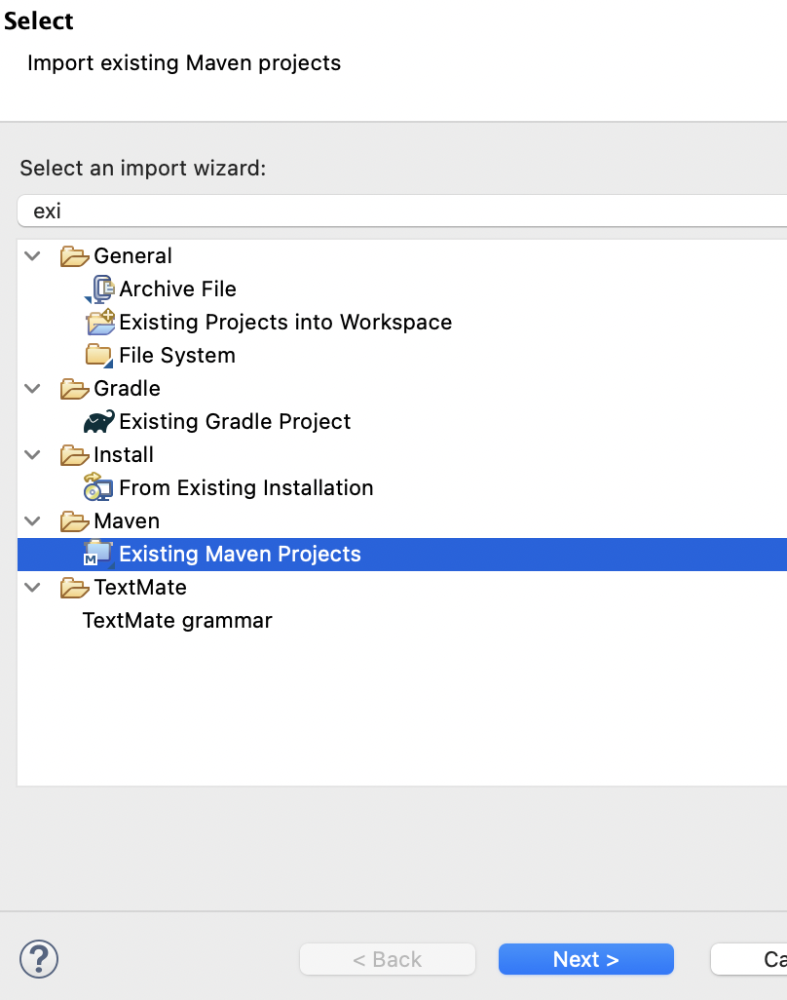
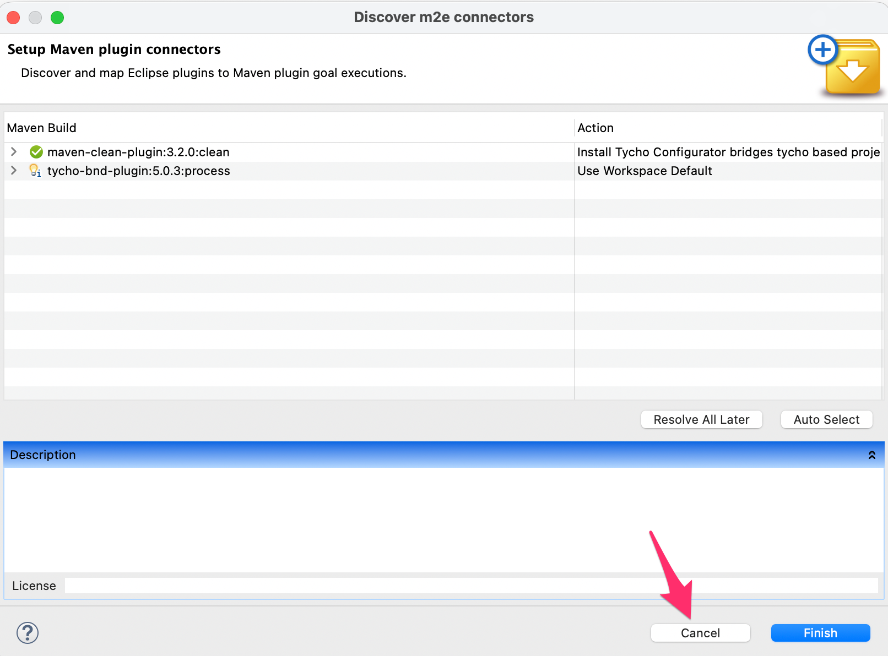

# Building from Source

## Prerequisites

- Java 21
- Maven 3.9+
- Eclipse 2025-12 with PDE (Plugin Development Environment)

## Build Commands

```bash
# Clone the repository
git clone https://github.com/sterlp/eclipse-peon-ai.git
cd eclipse-peon-ai

# Build the complete project and eclipse plugin tests
mvn clean verify

# Build with junit core tests
mvn clean package
```

## Development Launch

To run the plugin in development mode:

1. Install Eclipse IDE for RCP and RAP Developers
2. Import the project into Eclipse using maven

3. IMPORTANT: Skip the tycho plugin install - as it starts conflicting with eclipse tycho plugin - resolve all later and finish

4. Create an Eclipse Application launch configuration
5. Add arguments: `-clean -clearPersistedState`
6. Run the launch configuration

## Known Issues

### Incremental Build Bug

Eclipse 4.38 has a PDE/JDT bug where incremental builds produce broken `.class` files after the first launch.

**Workaround**: Use **Project > Clean** before re-launching the Eclipse Application.